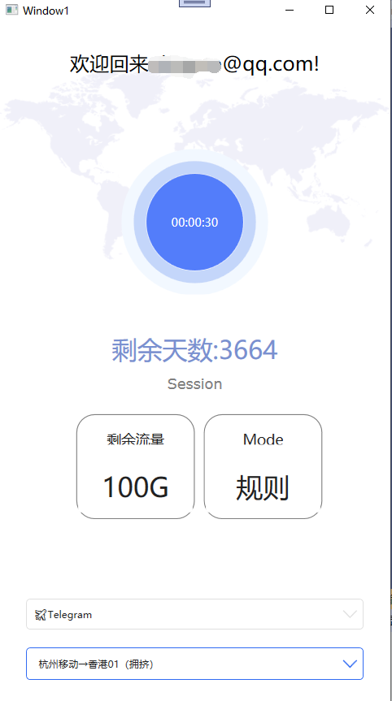
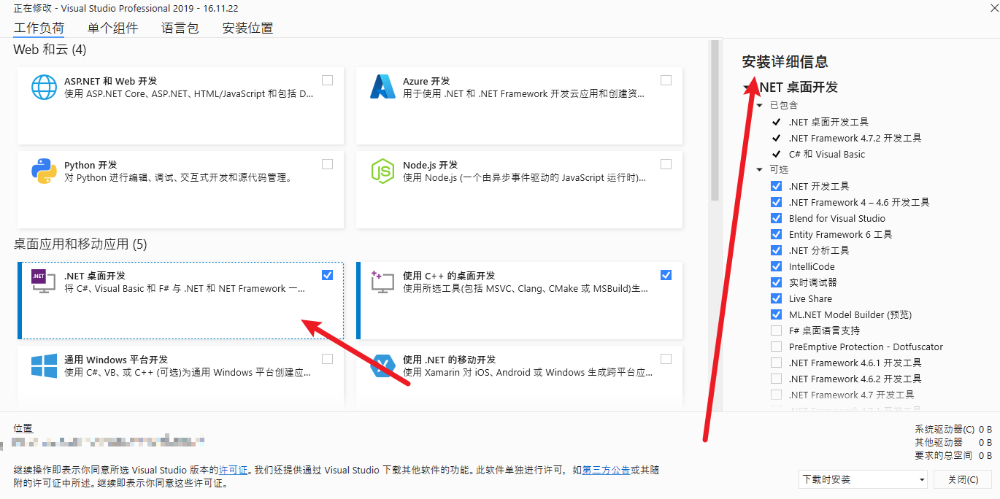

# Netboard

免费开源机场客户端

支持 [Clash core](https://github.com/Dreamacro/clash) 和[Clash.Meta core](https://github.com/MetaCubeX/Clash.Meta)

内核控制源码来自[2dust/clashN](https://github.com/2dust/clashN)

## 编译

使用Visual Studio 2019

项目metron/GlobalConfig.cs内填写sspanel地址

然后编译即可

最后在bin/Clash下放入clash内核的可执行文件即可

## 获得帮助

https://t.me/TalkToJshi

反馈bug建议直接提交issure，不提供无偿安装搭建服务